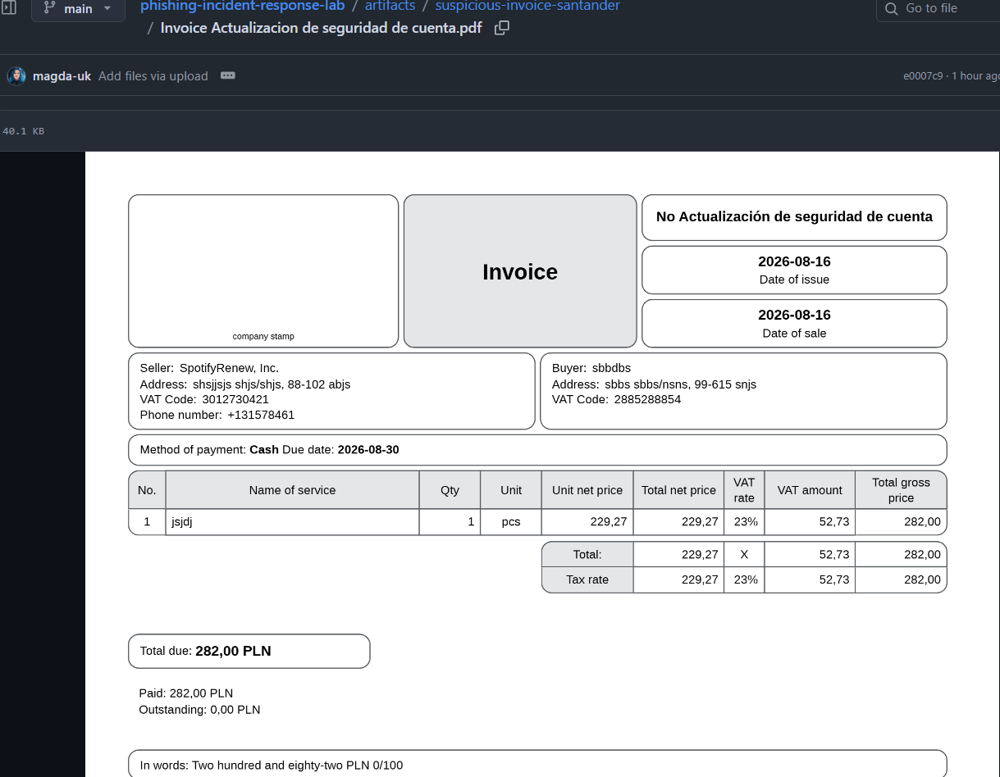

# Suspicious Invoice SantanderEquipo / inFakt.pl Phishing Campaign

## 📌 Overview
> **Investigative Context:** This analysis is not based on a fabricated lab dataset. It is a real, in-the-wild phishing attempt that I personally intercepted and triaged using safe isolation methodologies.

This folder contains the artefact attached to a real phishing email I received.  
The attacker impersonated “SantanderEquipo, Inc.” and used the Polish invoicing platform inFakt.pl to generate a fake invoice PDF.

The artefact is part of a broader phishing attempt involving:
- spoofed sender identity  
- malicious external link  
- mass-targeting of victims  
- fake invoice to add legitimacy  

---

## 📁 Files in this folder

### **Invoice Actualizacion de seguridad de cuenta.pdf** original phishing artefact
The original PDF attached to the phishing email.  
Stored here for safe static analysis and sandboxing.

### **pdf-analysis.md**
## 📸 PDF Preview

Full analysis of the PDF, including:
- fraud indicators  
- document structure  
- social engineering purpose  
- expected sandbox behaviour  
- conclusions and recommendations  

---

## 🔒 Safety Notes
- The PDF must **not** be opened locally.  
- All analysis should be performed in a sandbox environment.  
- GitHub stores the file safely as static content.

---

## 🧭 Related Case
See:  
`headers/suspicious-email-real-case.md`  
for the full email header analysis and phishing investigation.
