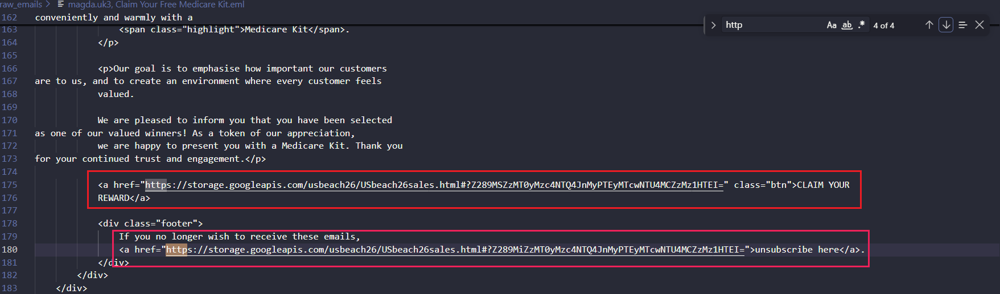

# Incident Report: NHS "Medicare Kit" Credential Harvesting

  
  
  
  
  

## 🔺 Executive Summary
This case involves a mass-phishing campaign impersonating the UK National Health Service (NHS), attempting to lure victims with a fabricated "Free Medicare Kit". The threat actor exhibits poor cultural localization (mixing UK NHS branding with US Medicare terminology) but employs advanced evasion techniques. The campaign abuses legitimate Google Cloud Storage infrastructure to host the malicious payload and utilizes compromised third-party domains to route bounce messages, effectively bypassing standard email gateway filters.

## 🔺 Email & Header Triage
-   **Subject:** magda.uk3, Claim Your Free Medicare Kit
-   **From:** 'NHS App-Rewards' `<MptNSXgN@pOhaKxwEv.fr>`
-   **To:** Victim Address
-   **Return-Path:** `<return26312@8qa3zei20lh9mtp26312...dentdevils-eastsussex.com>`

- **Spoofing & Evasion Indicators:**
  *   **Brand Mismatch:** The sender claims to be the NHS but uses a randomized French domain (`.fr`).
  *   **Infrastructure Hijacking:** The `Return-Path` points to a compromised legitimate UK business domain (`dentdevils-eastsussex.com`), heavily obfuscated with a Domain Generation Algorithm (DGA) pattern to handle bounce tracking without triggering spam blocks.

## 🔺 URL & Infrastructure Analysis
The email body contains no malicious attachments, relying entirely on embedded HTML links to drive traffic to a credential harvesting portal. 

-   **Raw URL:** `https://storage.googleapis.com/usbeach26/USbeach26sales.html#?Z289MSZzMT0...`
-   **Defanged (CyberChef):** `hxxps://storage[.]googleapis[.]com/usbeach26/USbeach26sales[.]html`

* **📸 HTML Source Analysis:**

* **Tactical Observations:**
  *   **Legitimate Cloud Abuse:** The payload is hosted on `storage.googleapis.com`. Threat actors abuse Google Cloud to inherit its positive domain reputation, rendering root-domain blocking impossible for defenders.
  *   **Base64 Victim Tracking:** The URL fragment following `#?` contains a Base64-encoded string. This is a tracking mechanism used to identify which specific victim clicked the link, allowing the attacker to validate active email addresses.
  *   **The "Unsubscribe" Trap:** Both the primary "CLAIM YOUR REWARD" button and the "unsubscribe here" footer link point to the exact same malicious payload. This double-trap exploits both user greed and user frustration.

## 🔺 Defensive Recommendations
1.  **Granular Web Blocking:** Do not block `googleapis.com`. Instead, block the specific URI path `storage.googleapis.com/usbeach26/` at the web proxy or firewall level.
2.  **Email Gateway Rules:** Implement pattern matching rules to quarantine inbound emails containing the DGA pattern `*.dentdevils-eastsussex.com` in the Return-Path.
3.  **Threat Hunting:** Query proxy and DNS logs for any internal traffic requesting the `usbeach26` Google Cloud storage bucket to identify users who may have clicked the link.

---
🔺Let's connect

