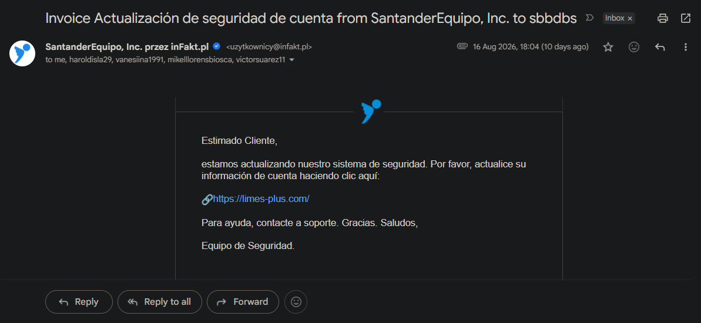
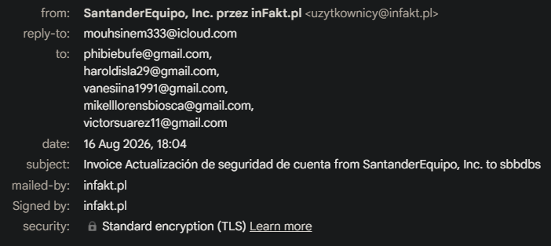
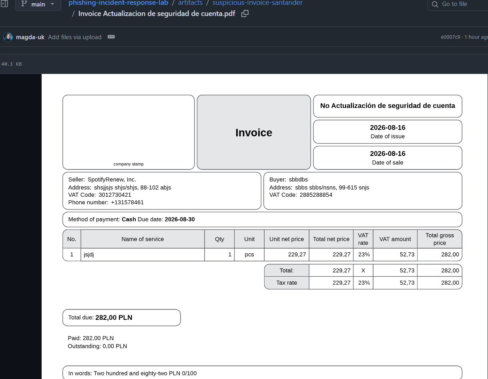

# Incident Report: Santander Spoofed Security Update

  
  
  
  
  

## ▫️ Executive Summary
This case involves a real-world phishing campaign impersonating Santander ("SantanderEquipo, Inc."). The attacker leveraged a legitimate Polish invoicing service (`infakt.pl`) to spoof the delivery mechanism and bypass basic spam filters. The primary objective is credential harvesting via a malicious external link, using a fabricated PDF invoice as a psychological trigger to create urgency.

## ▫️Email & Header Triage
*   **Subject:** Invoice Actualizacion de seguridad de cuenta
*   **From:** SantanderEquipo, Inc. <uzytkownicy@infakt.pl>
*   **Reply-To:** mouhisenm333@icloud.com
*   **Message-ID:** `<80e64edf394b9cc28266b09e9d20a56ea30a3c649e5a52772410d4044594@mail.app.infakt.pl>`
*   **Recipients:** Multiple unrelated victims (Mass-targeting).

* **📸 Email Overview & Headers:**

* **Spoofing & Evasion Indicators:**
  *   **Domain Mismatch:** The sender domain (`infakt.pl`) completely contradicts the display name (Santander).
  *   **Suspicious Reply-To:** Diverts replies to a personal iCloud email, a classic operational security failure by the threat actor.

## ▫️URL & Infrastructure Analysis
The email body instructs the user to update their account security by visiting an external link.

*   **Raw URL:** `https://limes-plus.com/`
*   **Defanged (CyberChef):** `hxxps://limes-plus[.]com/`
*   **Root Domain:** `limes-plus.com`

* **Threat Intelligence (VirusTotal & ANY.RUN Expectations):**
  *   The parsed domain has zero legitimate association with Santander's infrastructure.
  *   Expected sandbox detonation behavior involves redirection to a credential-harvesting form masking as a banking portal. Sandbox captures should prioritize the final landing page HTML and secondary domains loaded during redirection.

## ▫️Attachment Triage (PDF)
*   **Filename:** `Invoice Actualizacion de seguridad de cuenta.pdf`
*   **Role:** Social Engineering Artefact

* **📸 PDF Preview (Safe View):**

* **Static Analysis Findings:**
The document mimics a Polish invoice generated via inFakt.pl but contains deliberately fabricated, nonsensical data (e.g., Seller: SpotifyRenew, Inc., Buyer: sbbdbs). 

* > The file contains no active exploits or malware. Its sole purpose is to reinforce the email's narrative, confusing the victim and increasing the likelihood of interaction with the phishing link.

## ▫️Defensive Recommendations
1.  **Network Blocking:** Blacklist the root domain `limes-plus.com` on all firewalls and web proxies.
2.  **Email Quarantine:** Implement a mail gateway rule to drop inbound traffic containing the Reply-To address `mouhisenm333@icloud.com`.
3.  **Log Review:** Query SIEM/Proxy logs for any internal IP addresses that successfully connected to the malicious URL to identify potential compromises.

## ▫️Let's connect

