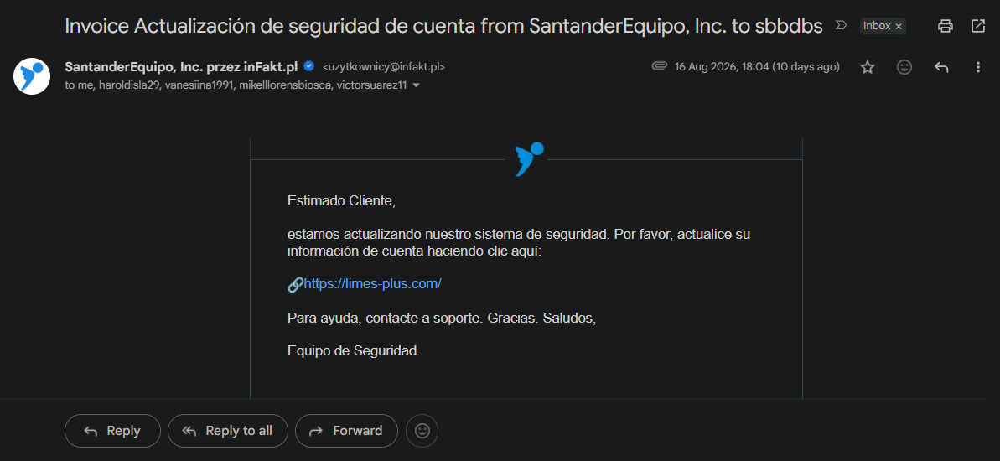
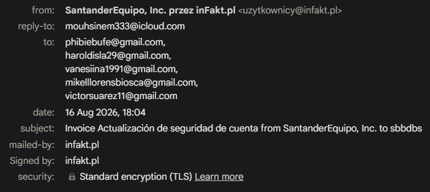

# Real Phishing Case : **_Spoofing + Fake Invoice + Malicious Link_**

## 🧩 Overview
This case is based on a real phishing email I personally received.  
The message impersonates “SantanderEquipo, Inc.” while being sent through the Polish invoicing service inFakt.pl and redirecting victims to a malicious external domain.

The email combines:
- spoofing
- fake invoice
- credential harvesting attempt
- mass‑targeting of multiple recipients

---

## 📧 Email Summary
- **Subject:** Invoice Actualización de seguridad de cuenta  
- **Display Name:** SantanderEquipo, Inc.  
- **From:** uzytkownicy@infakt.pl  
- **Reply‑To:** mouhisenm333@icloud.com  
- **Recipients:** multiple unrelated victims  
- **Attachment:** PDF (“Invoice Actualiza…”)  
- **Link:** https://limes-plus.com/
### 📸 Email Overview

### 📸 Header Details

---

## 🕵️ Header Findings

### 1. Sender domain mismatch
The email claims to be from “SantanderEquipo, Inc.” but is sent via:
- `infakt.pl` (Polish invoicing service)
- Reply‑To: `icloud.com` (personal mailbox)

This is a strong indicator of spoofing.

### 2. Multiple unrelated recipients
The email was sent to several unrelated Gmail accounts.  
This confirms a mass phishing campaign.

### 3. Suspicious Reply‑To
`mouhisenm333@icloud.com`  
Legitimate companies never use personal iCloud accounts for support or billing.

### 4. Malicious link
The message urges the user to “update account security” via:
https://limes-plus.com/

This domain is unrelated to Santander or inFakt and is used for credential harvesting.

### 5. Fake invoice attachment
A PDF named “Invoice Actualiza…” is attached.  
Phishing campaigns often use PDFs to:
- embed malicious links  
- impersonate invoices  
- add legitimacy to the scam

---

## 🔍 Analysis
Indicators of phishing:
- sender identity inconsistency  
- domain mismatch  
- mass-targeting  
- malicious external link  
- fake invoice  
- generic, non-personalised message  
- suspicious Reply‑To  
- urgency + security theme  

The attacker attempts to:
1. trick the victim into clicking the malicious link  
2. harvest credentials or financial information  
3. add legitimacy via a fake invoice PDF  

---

## 🛡 Recommended Response
1. Block sender domain (`infakt.pl` used maliciously in this context).  
2. Block malicious domain (`limes-plus.com`).  
3. Notify security team and affected users.  
4. Add IoCs to phishing indicators list.  
5. Analyse the PDF in a sandbox (ANY.RUN / Joe Sandbox).  
6. Review logs for any clicks on the link.

---

## 📝 Conclusion
This is a clear phishing attempt combining spoofing, fake invoicing, and credential harvesting.  
Header analysis, link inspection, and attachment behaviour are sufficient to classify the email as malicious.

---
## 🔺 Author
Magda Dominguez

SOC Analyst (L1-ready) Bristol, UK

Focused on Blue Team operations, detection engineering and log analysis.
